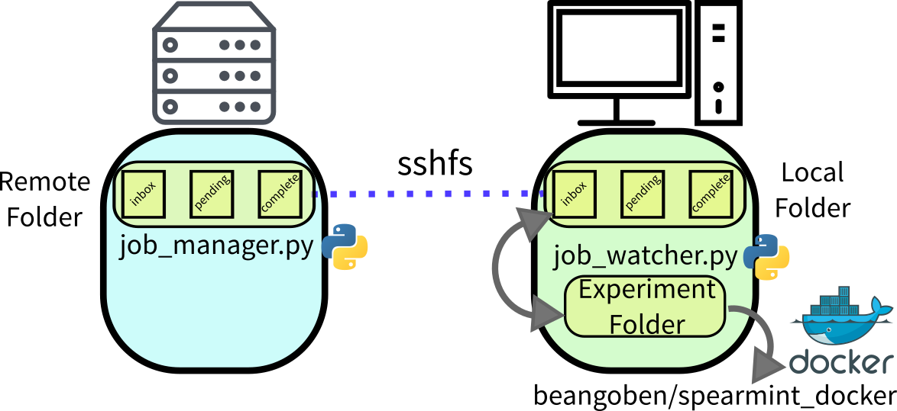

# Supercomputer BO optimizer

These scripts are made to run spearmint as a bayesian optimizer on a local machine as a docker image. Job files are created and monitored and then results parsed out to create new jobs. Jobs are submitted to a supercomputer cluster using slurm.

Use for optimizing the hyperparameters for a variational autoencoder on MNIST data.



To use it, you will want to modify **bo_utils.py**. Three folder locations are important:

1. **remote odyssey folder**, this is where you will run your job submitter (*/n/odyssey/jobs* below).
2. **local sshfs folder**, where you mount the remote folder to receive and send files (*/home/beangoben/projects/test/jobs* below).
3. **local spearmint folder**, where you will run the docker image
(*/home/beangoben/projects/spearmint_docker/ody_bo* below).

Following are the steps to run it:

1. **Edit bo_utils and templates**, to automate the generation and parsing of files.
2. **Run your remote job manager**.
3. **Mount remove folder with ssfs**.
4. **Run docker image on the spearmint folder**.
5. **Run job_watcher.py**.

## Edit bo_utils and templates

* **bo_loop.py** is the bo file that imports **bo_utils.py** to do the whole bo loop. Not much editing is needed here.
* **bo_utils.py** is a python module used in bo_loop.py, it has functions for :
  1. (`create_job(job_id, param, job_dir)`) : Creating all the job files neeeded to run in your supercomputer
  2. (`parse_job(job_id, job_dir)`): Parsing calculations for results from a job, will be looking for a string called " Final Result = ".
  3. (`not_ready(job_id, job_dir)`): Determine when a calculation is ready to be parsed, basically scanning the result file for a string such as "\*\*FINISHED\*\*".
  4. Also contains other utility functions.
* **templates** if a folder with template files for a normal job. **bo_utils.py** uses jinja2 to do text replacement on several files.
* **config.json** hyperparameter space to explore.

## Run the job manager
Assuming you are in a directory inside of your favorite supercomputer (maybe odyssey) you run a command to start your automated job submitter, for example:

```
python job_manager.py -r "$(pwd)"/jobs
```

## Mount virtual drive locally
Using sshfs, assuming *path_to_jobs* is the previous folder location in the supercomputer.
```
sshfs user@domain:/n/odyssey/jobs /home/beangoben/projects/test/jobs
```
## Run docker image on this folder
An extra last number is optional (i.g. 8890), this is the port number for the docker server.
```
./run_spearmint.sh ody_bo
```
## Run job_watcher.py

```
python job_watcher.py /home/beangoben/projects/spearmint_docker/ody_bo /home/beangoben/projects/test/jobs
```
